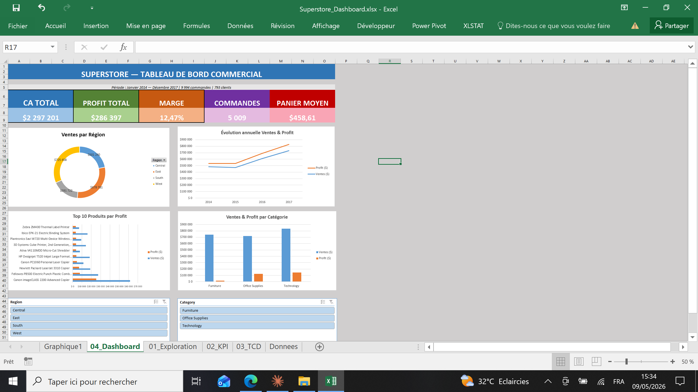
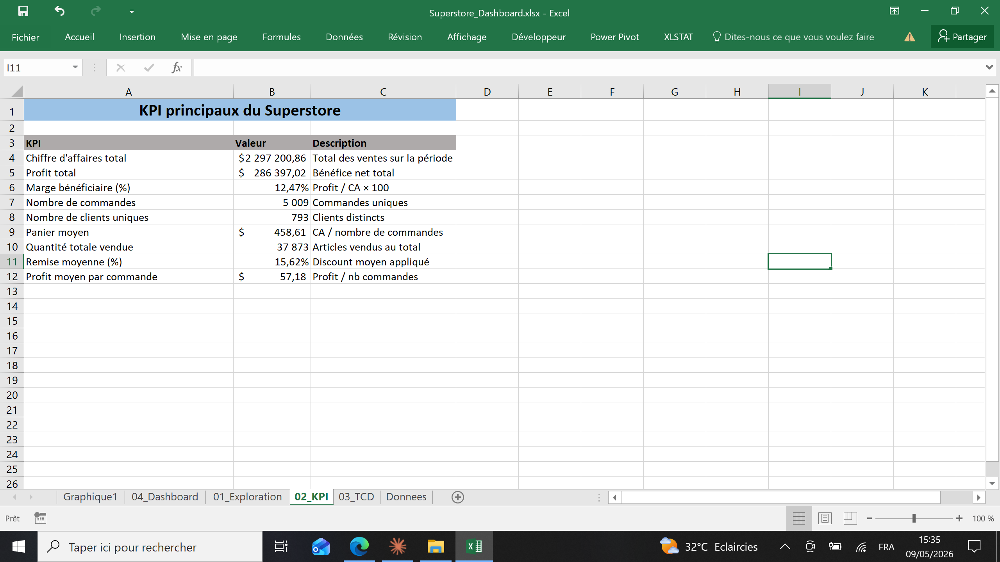
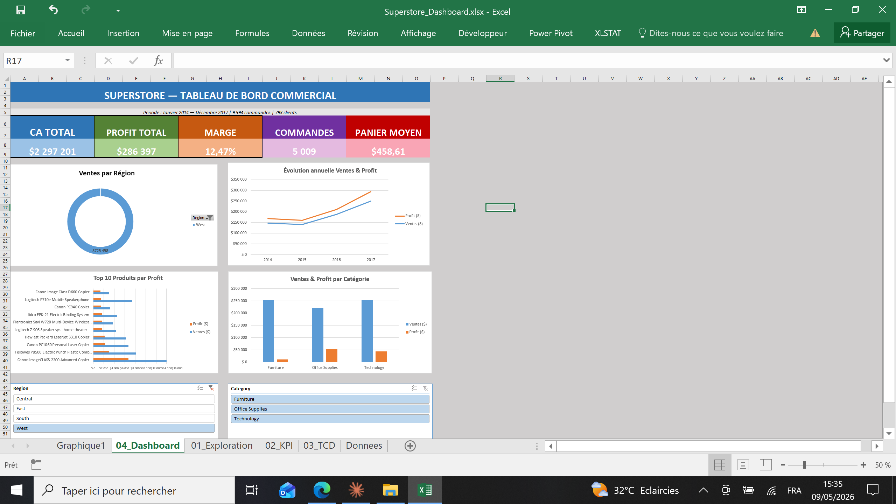

# 📊 Tableau de bord des ventes Superstore — Excel

> **Projet 1 / 12** du parcours portfolio Data Analyst  
> **Outil principal** : Microsoft Excel (Power Query, Tableaux croisés dynamiques, Graphiques, Slicers)  
> **Durée du projet** : ~5 heures  
> **Niveau** : Débutant / Intermédiaire

---

## 🎯 Problématique métier

Une grande chaîne de magasins américaine (**Superstore**) vend des meubles, des fournitures de bureau et des produits technologiques à travers les États-Unis. Le directeur commercial dispose de **9 994 lignes de commandes** sur **4 ans (2014-2017)** mais aucune visibilité claire sur la performance globale.

> *« Quelles régions performent le mieux ? Quels produits font perdre de l'argent ? Sommes-nous en croissance ? Comment optimiser nos décisions ? »*

L'objectif est de transformer ces données brutes en un **tableau de bord interactif** pour permettre une prise de décision rapide.

---

## 🚀 Objectifs du projet

- Nettoyer et structurer les données avec **Power Query**
- Calculer **9 KPI business** clés (CA, profit, marge, panier moyen, etc.)
- Créer **5 tableaux croisés dynamiques** d'analyse multi-dimensionnelle
- Construire **un dashboard interactif** avec graphiques et slicers
- Identifier les **insights actionnables** pour le management
- Publier le projet sur **GitHub** avec une documentation professionnelle

---

## 🛠️ Outils & compétences mobilisées

| Compétence | Détail |
|---|---|
| **Power Query** | Import CSV, nettoyage, gestion des locales (US/FR), conversion de types |
| **Excel avancé** | Tableaux structurés, formules dynamiques (SOMMEPROD, NB.SI, etc.) |
| **Tableaux croisés dynamiques** | Hiérarchies, champs calculés, % du total, filtres Top N |
| **Visualisation de données** | Donut chart, courbes, barres horizontales/verticales |
| **Interactivité** | Slicers connectés à plusieurs TCD |
| **Analyse business** | Identification des produits déficitaires et des pépites |
| **Git / GitHub** | Versionning, README professionnel, publication |

---

## 📂 Structure du projet

```
01-sales-dashboard-excel/
├── dataset/
│   └── Sample - Superstore.csv          # Dataset brut (10 000 lignes)
├── dashboard/
│   └── Superstore_Dashboard.xlsx        # Fichier Excel final
├── images/
│   ├── dashboard_complet.png            # Vue d'ensemble du dashboard
│   ├── dashboard_kpi.png                # Détail des KPI
│   └── dashboard_filtre_west.png        # Dashboard filtré (interactivité)
├── reports/
│   └── etapes_power_query.md            # Documentation des étapes Power Query
└── README.md                             # Ce fichier
```

---

## 📊 Le dataset

**Source** : [Sample Superstore Dataset (Kaggle)](https://www.kaggle.com/datasets/vivek468/superstore-dataset-final)

| Caractéristique | Détail |
|---|---|
| Lignes | 9 994 transactions |
| Période | Janvier 2014 → Décembre 2017 |
| Clients uniques | 793 |
| Commandes uniques | 5 009 |
| Produits | ~1 850 |
| Régions | 4 (Central, East, South, West) |
| Catégories | 3 (Furniture, Office Supplies, Technology) |
| Sous-catégories | 17 |

---

## 🔧 Méthodologie

### 1. Importation et nettoyage (Power Query)

Le fichier CSV présentait plusieurs problèmes critiques :
- Mauvaise interprétation des dates (format US `MM/DD/YYYY` vs format FR)
- Nombres décimaux stockés en texte (séparateur `.` vs `,`)
- Lignes mal découpées dues aux virgules dans les noms de produits

**Solution** : utilisation de **Power Query** avec spécification explicite de la **locale "Anglais (États-Unis)"** pour la conversion des dates et nombres décimaux. Toutes les transformations sont enregistrées et reproductibles.

📎 *Détail complet des étapes dans `reports/etapes_power_query.md`*

### 2. Exploration et calcul des KPI

| KPI | Valeur |
|---|---|
| 💰 **Chiffre d'affaires total** | **2 297 201 $** |
| 💵 **Profit total** | **286 397 $** |
| 📊 **Marge bénéficiaire** | **12,5 %** |
| 📦 **Nombre de commandes** | **5 009** |
| 👥 **Clients uniques** | **793** |
| 🛒 **Panier moyen** | **458,61 $** |
| 📅 **Quantité totale vendue** | **37 873 articles** |
| 🎟️ **Remise moyenne** | **15,6 %** |
| 💹 **Profit moyen / commande** | **57,18 $** |

### 3. Tableaux croisés dynamiques créés

1. **Ventes & Profit par Région** (avec marge et % du total CA)
2. **Catégorie / Sous-catégorie** (hiérarchique avec marge)
3. **Évolution annuelle** (2014-2017 avec drill-down par mois)
4. **Top 10 Produits par Profit** (filtre Top N)
5. **Segment Client × Région** (matrice 2D)

### 4. Construction du dashboard

Une **feuille dédiée** rassemble :
- 📌 Titre et sous-titre informatif
- 🎨 5 cartouches KPI colorés et lisibles
- 🍩 Donut « Ventes par Région »
- 📈 Courbe d'évolution Ventes & Profit
- 📊 Top 10 produits en barres horizontales
- 📊 Comparaison par catégorie en colonnes
- 🎚️ 2 slicers interactifs (Région, Catégorie) connectés à tous les TCD

---

## 📸 Aperçu du dashboard

### Vue d'ensemble



### Zoom sur les KPI



### Filtrage interactif (exemple : région West)



---

## 💡 Principaux insights business

### 🏆 Régions
- **West** est la région la plus performante (31,6 % du CA, marge de 14,9 %)
- **Central** affiche la marge la plus faible (7,9 %) malgré un volume conséquent — **investigation nécessaire**

### ⚠️ Produits déficitaires identifiés
- **Tables : -17 725 $ de pertes** (-8,6 % de marge !)
- **Bookcases : -3 473 $ de pertes** (-3 % de marge)
- **Supplies : -1 189 $ de pertes** (-2,5 % de marge)

→ Ces 3 sous-catégories font collectivement **perdre plus de 22 000 $** à l'entreprise.

### 🌟 Pépites à pousser
- **Labels (44 % de marge)** et **Paper (43 % de marge)** : produits très rentables, peu valorisés
- **Copiers (37 % de marge)** : volume faible mais rentabilité énorme
- **Canon imageCLASS 2200** seul génère **25 200 $ de profit** (8,8 % du profit total)

### 📈 Tendances temporelles
- Croissance impressionnante : +51 % de CA entre 2014 et 2017
- Le profit a été multiplié par **2,7** sur la même période
- Stagnation sur 2014-2015 puis explosion en 2016-2017

### 👥 Segments clients
- **Consumer** représente 50,6 % du CA (segment dominant)
- **West Consumer** est le bloc le plus important (15,7 % du CA total)

---

## 🎯 Recommandations business

1. **🚨 Action immédiate** : auditer pourquoi Tables, Bookcases et Supplies sont déficitaires (remises ? coûts logistiques ? mix produits ?)
2. **📣 Marketing** : pousser Labels, Paper et Copiers — produits ultra-rentables sous-exploités
3. **🌍 Géographie** : investiguer la marge faible en région Central (investigation comparative avec West)
4. **🎯 Stratégie clients** : renforcer la présence dans le segment Consumer West/East (47 % du CA)
5. **📊 Suivi** : actualiser ce dashboard mensuellement pour piloter la stratégie

---

## 🎓 Compétences démontrées

- ✅ **Importation rigoureuse** de données brutes (CSV avec problèmes de formatage)
- ✅ **Nettoyage reproductible** avec Power Query (étapes documentées)
- ✅ **Calcul de KPI métier** pertinents pour la prise de décision
- ✅ **Analyse multidimensionnelle** via tableaux croisés dynamiques
- ✅ **Création de visualisations** adaptées (donut, courbe, barres, colonnes)
- ✅ **Conception de dashboard interactif** avec slicers
- ✅ **Identification d'insights actionnables** et formulation de recommandations
- ✅ **Communication** des résultats via documentation GitHub

---

## 🚀 Pour reproduire ce projet

1. **Cloner le repository** :
   ```bash
   git clone https://github.com/barde44/portfolio-data-analyst.git
   cd portfolio-data-analyst/01-sales-dashboard-excel
   ```

2. **Télécharger le dataset** depuis [Kaggle](https://www.kaggle.com/datasets/vivek468/superstore-dataset-final) et le placer dans `dataset/`

3. **Ouvrir le fichier** `dashboard/Superstore_Dashboard.xlsx`

4. **Suivre les étapes Power Query** détaillées dans `reports/etapes_power_query.md` si vous souhaitez reconstruire le projet from scratch.

---

## 🔄 Limitations du projet

- Les **KPI affichés en haut du dashboard** (cartouches colorés) ne sont **pas filtrés par les slicers** car ils utilisent des formules de tableau classique. Pour les rendre dynamiques, une migration vers **Power Pivot avec mesures DAX** serait nécessaire.
- Le dataset s'arrête en **décembre 2017**, ce qui ne permet pas d'analyser les tendances post-COVID.
- Pas d'analyse géographique fine au niveau **État** ou **Ville** dans la version actuelle.

---

## 📚 Ressources & inspirations

- 📂 [Sample Superstore Dataset – Kaggle](https://www.kaggle.com/datasets/vivek468/superstore-dataset-final)
- 📺 Chaîne YouTube **LeCoinStat** par Natacha Njongwa Yepnga
- 📘 Documentation Power Query : [learn.microsoft.com](https://learn.microsoft.com/fr-fr/power-query/)

---

## 👤 À propos

Ce projet fait partie d'un parcours de **12 projets pour devenir Data Analyst**, couvrant Excel, SQL, Python/R, Power BI et Tableau.

📩 **Me contacter** : [LinkedIn](https://www.linkedin.com/in/barde-steven/) | [Email](mailto:bardesteven17@gmail.com)  
🔗 **Portfolio complet** : [github.com/<barde44>/portfolio-data-analyst](https://github.com/barde44/portfolio-data-analyst)

---
⭐ **Si ce projet t'a été utile, n'hésite pas à mettre une étoile sur le repo !**
