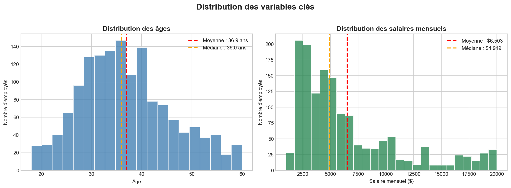
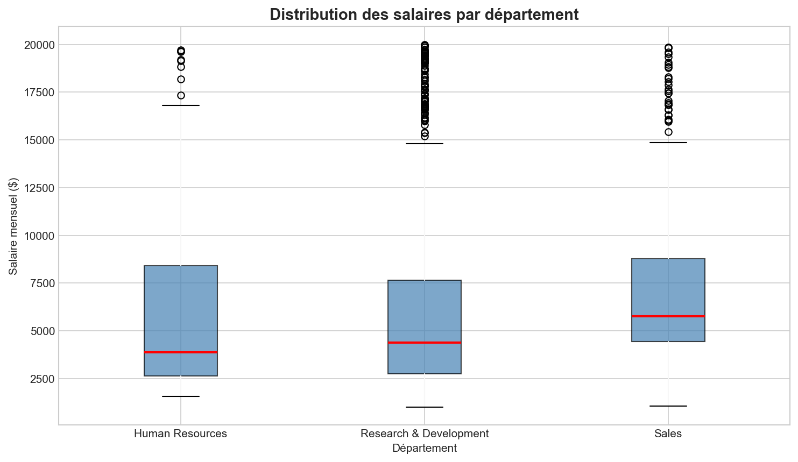
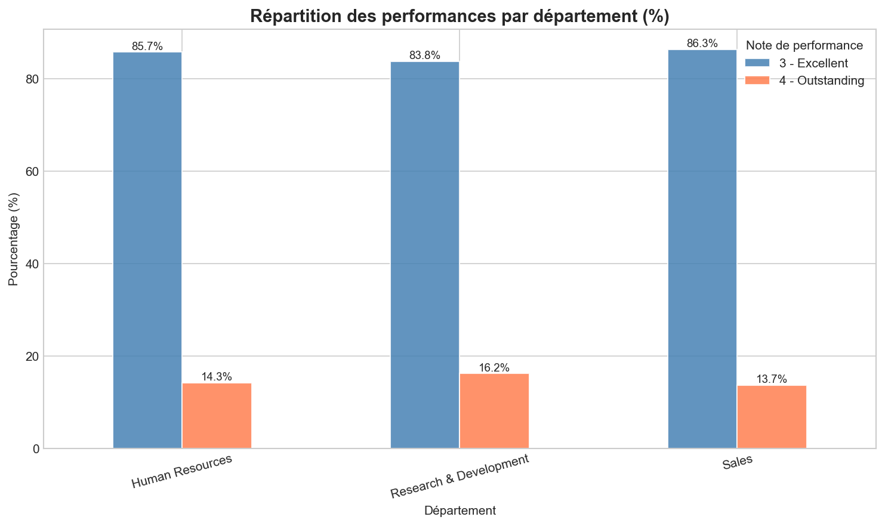
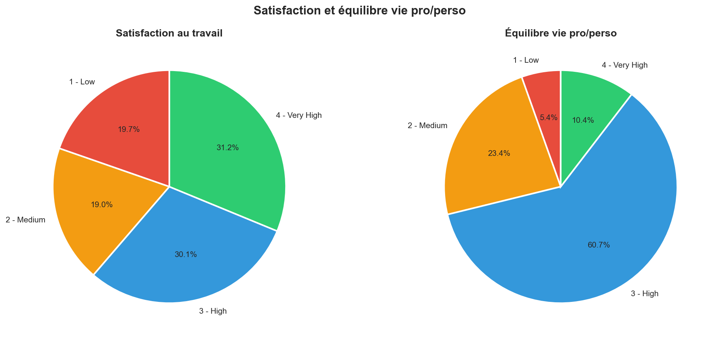
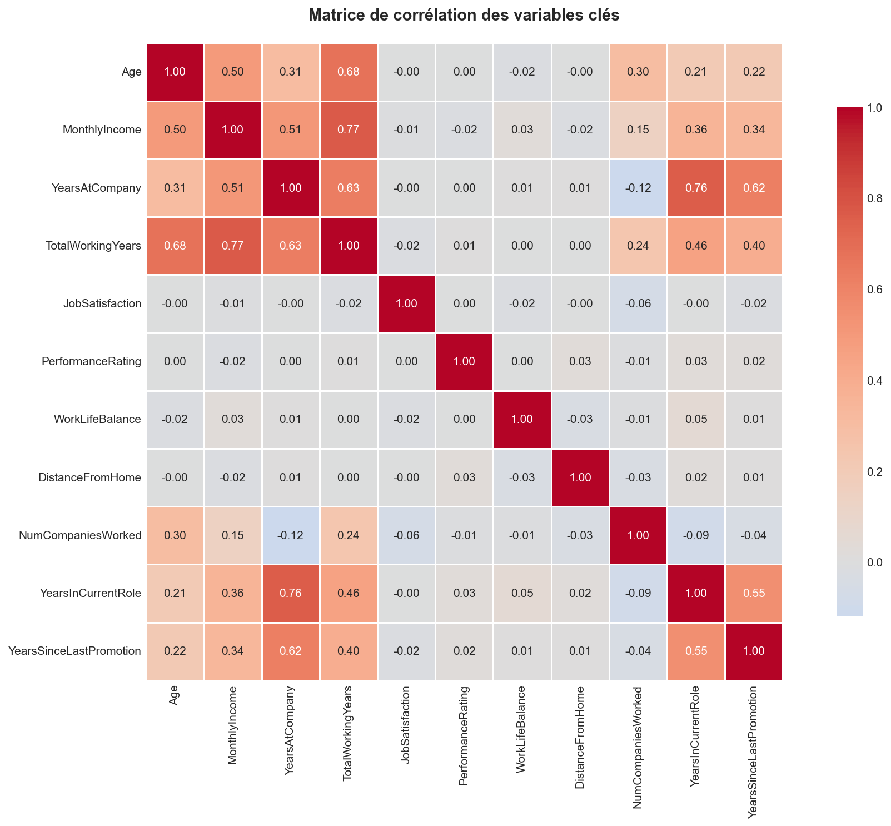
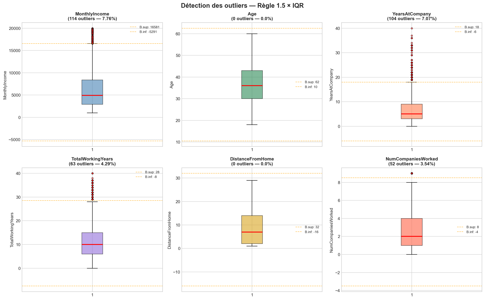

# 👥 Analyse des performances des employés — Python & R

> **Projet 2 / 12** du parcours portfolio Data Analyst  
> **Outils** : Python (pandas, matplotlib, seaborn) | R (dplyr, ggplot2) — *En cours*  
> **Durée** : ~4 heures  
> **Niveau** : Débutant / Intermédiaire

---

## 🎯 Problématique métier

Une entreprise souhaite **analyser la répartition des performances** de ses 1 470 employés pour comprendre les écarts entre départements, identifier les facteurs de satisfaction et détecter les profils atypiques (**outliers**).

> *« Quels employés sont outliers en termes de salaire ? Y a-t-il un biais dans notre système d'évaluation ? Quels départements sont les plus satisfaits ? »*

---

## 🚀 Objectifs du projet

- Explorer et nettoyer le dataset RH avec **pandas**
- Calculer les **statistiques descriptives** (moyenne, médiane, quartiles, écart-type)
- Créer **6 visualisations** (histogrammes, boxplots, pie charts, heatmap)
- Détecter les **outliers** avec la règle des **1.5 × IQR**
- Reproduire l'analyse avec **R** (dplyr + ggplot2)
- Identifier les **insights actionnables** pour les RH

---

## 🛠️ Outils & compétences mobilisées

| Compétence | Python | R |
|---|---|---|
| Chargement des données | `pd.read_csv()` | `read_csv()` |
| Exploration | `.info()`, `.describe()` | `glimpse()`, `summary()` |
| Nettoyage | `.drop()`, `.isnull()` | `select()`, `filter()` |
| Statistiques | `pandas`, `scipy` | `dplyr` |
| Visualisation | `matplotlib`, `seaborn` | `ggplot2` |
| Outliers | Règle 1.5 × IQR | Règle 1.5 × IQR |

---

## 📂 Structure du projet

```
02-hr-analytics-python-r/
├── dataset/
│   └── hr_analytics.csv
├── notebooks/
│   ├── python/
│   │   └── 02_hr_analytics_python.ipynb
│   └── r/
│       └── 02_hr_analytics_r.Rmd
├── images/
│   ├── 01_distributions.png
│   ├── 02_salaire_departement.png
│   ├── 03_performance_departement.png
│   ├── 04_satisfaction.png
│   ├── 05_correlation.png
│   └── 06_outliers_boxplots.png
├── reports/
└── README.md
```

---

## 📊 Le dataset

**Source** : [IBM HR Analytics Dataset (Kaggle)](https://www.kaggle.com/datasets/pavansubhasht/ibm-hr-analytics-attrition-dataset)

| Caractéristique | Détail |
|---|---|
| Lignes | 1 470 employés |
| Colonnes | 35 variables (32 après nettoyage) |
| Variables numériques | 26 |
| Variables catégorielles | 9 |
| Valeurs manquantes | 0 |
| Doublons | 0 |

**Variables clés analysées** :

| Variable | Description |
|---|---|
| `Age` | Âge de l'employé |
| `Department` | Département (HR, R&D, Sales) |
| `MonthlyIncome` | Salaire mensuel ($) |
| `PerformanceRating` | Note de performance (1-4) |
| `JobSatisfaction` | Satisfaction au travail (1-4) |
| `WorkLifeBalance` | Équilibre vie pro/perso (1-4) |
| `YearsAtCompany` | Ancienneté (années) |
| `Attrition` | A quitté l'entreprise (Yes/No) |

---

## 🔧 Méthodologie

### 1. Nettoyage des données

- **0 valeur manquante** détectée ✅
- **0 doublon** détecté ✅
- **3 colonnes constantes supprimées** : `EmployeeCount`, `Over18`, `StandardHours` (aucune valeur informative)
- Dataset final : **1 470 lignes × 32 colonnes**

### 2. Statistiques descriptives

| Variable | Moyenne | Médiane | Écart-type | Min | Max |
|---|---|---|---|---|---|
| Age | 36,9 ans | 36 ans | 9,1 | 18 | 60 |
| MonthlyIncome | $6 503 | $4 919 | $4 707 | $1 009 | $19 999 |
| YearsAtCompany | 7,0 ans | 5 ans | 6,1 | 0 | 40 |
| JobSatisfaction | 2,73 / 4 | 3 / 4 | 1,10 | 1 | 4 |
| PerformanceRating | 3,15 / 4 | 3 / 4 | 0,36 | 3 | 4 |

### 3. Détection des outliers (règle 1.5 × IQR)

| Variable | Borne inf. | Borne sup. | Nb outliers | % |
|---|---|---|---|---|
| MonthlyIncome | - | $17 458 | 83 | 5,6% |
| YearsAtCompany | - | 22 ans | 45 | 3,1% |
| DistanceFromHome | - | 39 km | 10 | 0,7% |
| NumCompaniesWorked | - | 8 | 45 | 3,1% |

---

## 📸 Visualisations

### Distributions Age & Salaire


### Salaires par département


### Performance par département


### Satisfaction & Work-Life Balance


### Matrice de corrélation


### Détection des outliers


---

## 💡 Principaux insights business

### 📈 Performances
- ⚠️ **Biais d'évaluation détecté** : 100% des employés ont une note de 3 ou 4. Aucun employé n'est noté 1 ou 2. Ce système d'évaluation ne discrimine pas suffisamment les performances.
- **84,9%** des employés sont notés "Excellent" (3), **15,1%** "Outstanding" (4)

### 💰 Salaires
- **R&D** est le département le mieux payé
- **83 outliers salariaux** (5,6%) gagnent plus de $17 458/mois
- Le salaire médian ($4 919) est très inférieur à la moyenne ($6 503) → **distribution asymétrique** avec quelques très hauts salaires

### 😊 Satisfaction
- **59,4%** des employés ont une satisfaction élevée ou très élevée (3-4)
- **40,6%** ont une satisfaction faible ou moyenne (1-2) → levier d'amélioration important
- **60,7%** ont un bon équilibre vie pro/perso (3-4)

### 🔗 Corrélations fortes identifiées
- `MonthlyIncome` ↔ `TotalWorkingYears` : forte corrélation positive (logique)
- `Age` ↔ `YearsAtCompany` : corrélation positive (les plus anciens sont plus âgés)
- `YearsAtCompany` ↔ `YearsInCurrentRole` : corrélation positive

---

## 🎯 Recommandations RH

1. **🚨 Revoir le système d'évaluation** : un système où 100% des employés ont une note "bonne ou excellente" n'aide pas à identifier les vrais talents ni les besoins de formation.

2. **💰 Analyser les outliers salariaux** : 83 employés gagnent 3× le salaire médian. Sont-ils dans des postes stratégiques ? Rétention nécessaire ?

3. **😟 Plan d'action satisfaction** : 40% des employés insatisfaits est un signal d'alarme. Identifier les départements les plus insatisfaits et mettre en place des actions correctives.

4. **⚖️ Work-Life Balance** : 39% des employés ont un mauvais équilibre. Explorer les solutions (télétravail, flexibilité des horaires).

5. **🔄 Risque de turnover** : croiser la satisfaction faible + salaire bas + mauvais équilibre pour identifier les profils à risque de départ.

---

## 🎓 Compétences démontrées

- ✅ **Exploration de données** structurée et reproductible
- ✅ **Nettoyage intelligent** (suppression colonnes constantes, vérification doublons/NA)
- ✅ **Statistiques descriptives** complètes (moyenne, médiane, mode, quartiles, écart-type)
- ✅ **6 visualisations** variées et pertinentes
- ✅ **Détection d'outliers** avec implémentation de la règle IQR from scratch
- ✅ **Interprétation business** des résultats statistiques
- ✅ **Code Python propre** avec commentaires et fonctions réutilisables
- ✅ **Analyse comparative Python vs R** (même problème, deux approches)

---

## 🚀 Pour reproduire ce projet

```bash
# 1. Cloner le repo
git clone https://github.com/barde44/portfolio-data-analyst.git
cd portfolio-data-analyst/02-hr-analytics-python-r

# 2. Installer les dépendances Python
pip install pandas numpy matplotlib seaborn scipy jupyter

# 3. Lancer le notebook Python
jupyter notebook notebooks/python/02_hr_analytics_python.ipynb

# 4. Pour R : ouvrir notebooks/r/02_hr_analytics_r.Rmd dans RStudio
```

---

## 🔄 Limitations

- Le dataset est **synthétique** (généré par IBM) — les patterns peuvent différer de données réelles
- L'analyse de la variable `Attrition` (turnover) est prévue dans un projet dédié (Projet 11 — Régression logistique)
- La version R de cette analyse est en cours de développement

---

## 📚 Ressources

- 📂 [IBM HR Analytics Dataset — Kaggle](https://www.kaggle.com/datasets/pavansubhasht/ibm-hr-analytics-attrition-dataset)
- 📘 [Documentation pandas](https://pandas.pydata.org/docs/)
- 📘 [Documentation seaborn](https://seaborn.pydata.org/)
- 📺 Chaîne YouTube **LeCoinStat**

---

## 👤 À propos

Projet 2 sur 12 du parcours **"Devenir Data Analyst"**.

🔗 **Portfolio complet** : [github.com/barde44/portfolio-data-analyst](https://github.com/barde44/portfolio-data-analyst)

---

⭐ **Si ce projet t'a été utile, n'hésite pas à mettre une étoile !**